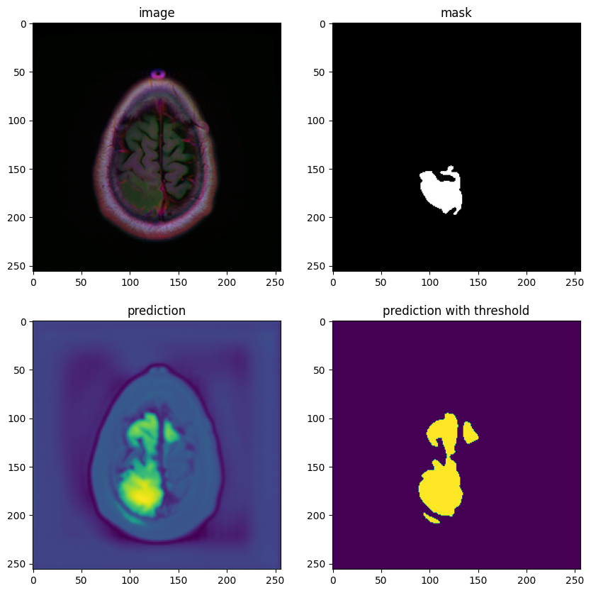
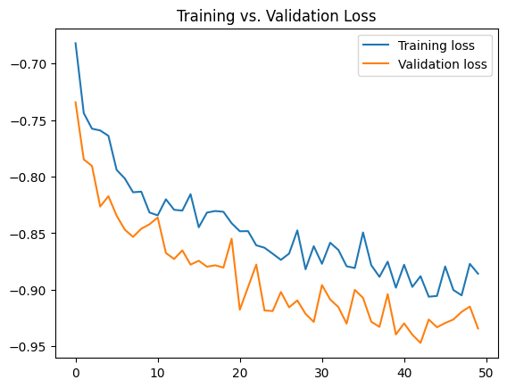

# Brain MRI Segmentation using UNet
U-Net implementation in PyTorch for FLAIR abnormality segmentation in brain MRI based on a deep learning segmentation algorith used in [U-Net: Convolutional Networks for Biomedical Image Segmentation](https://arxiv.org/pdf/1505.04597v1.pdf)

# Usage
## Running with pip environment (recommended)

It is recommended using a pip environment. To get started, clone this repo:
```bash
git clone https://github.com/rromer07/medical-image-segmentation.git
cd medical-image-segmentation
```
Create a pip environment and activate it.
```bash
# On Unix/macOS
python3 -m venv unet
source env/bin/activate
python3 -m pip install -r requirements.txt
```
```bash
# On Windows
python3 -m venv unet
.\env\Scripts\activate
```
## Running with conda environment (recommended)
Create a conda environment and activate it.
```bash
conda create -n unet python=3.8 -y
conda activate unet
pip install -r requirements.txt
```
## Run the `train.py` file.
Default `NUM_EPOCHS` set to **1000**.
```bash
python3 train.py
```

# Data
This dataset contains brain MR images together with manual FLAIR abnormality segmentation masks.
The images were obtained from The Cancer Imaging Archive (TCIA).
They correspond to 110 patients included in The Cancer Genome Atlas (TCGA) lower-grade glioma collection with at least fluid-attenuated inversion recovery (FLAIR) sequence and genomic cluster data available.
Tumor genomic clusters and patient data is provided in `data.csv` file.


All images are provided in `.tif` format with 3 channels per image.
For 101 cases, 3 sequences are available, i.e. pre-contrast, FLAIR, post-contrast (in this order of channels).
For 9 cases, post-contrast sequence is missing and for 6 cases, pre-contrast sequence is missing.
Missing sequences are replaced with FLAIR sequence to make all images 3-channel.
Masks are binary, 1-channel images.
They segment FLAIR abnormality present in the FLAIR sequence (available for all cases).


The dataset is organized into 110 folders named after case ID that contains information about source institution.
Each folder contains MR images with the following naming convention:

`TCGA_<institution-code>_<patient-id>_<slice-number>.tif`

Corresponding masks have a `_mask` suffix.
```bash
$ tree data
brainMRI
├───kaggle_3m
│   ├───TCGA_CS_4941_19960909
│   ├───TCGA_CS_4942_19970222
│   ...
│   └───TCGA_HT_A61B_19991127
└───lgg-mri-segmentation
    └───kaggle_3m
        ├───TCGA_CS_4941_19960909
        ├───TCGA_CS_4942_19970222
        ...
        └───TCGA_HT_A61B_19991127
```


# Model 


# Results
### UNet with Batch Normalization trained for 50 epochs

### Loss using Dice Coefficient 


